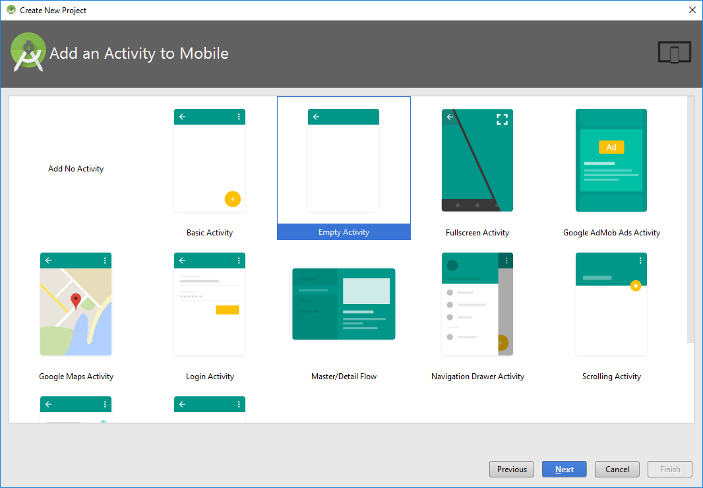
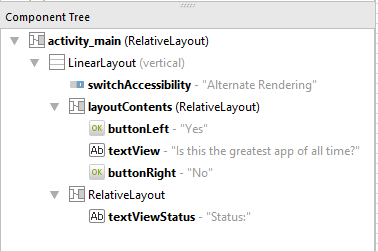
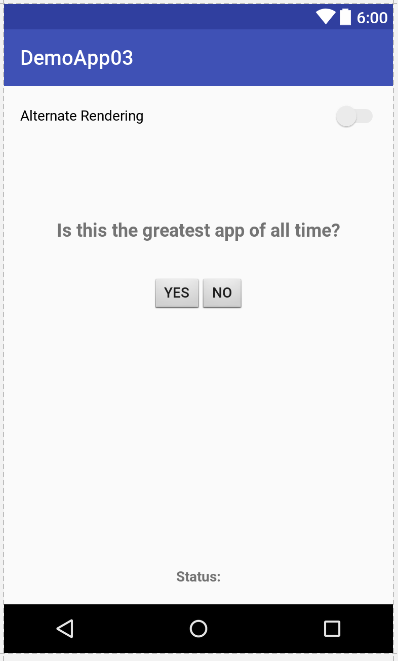
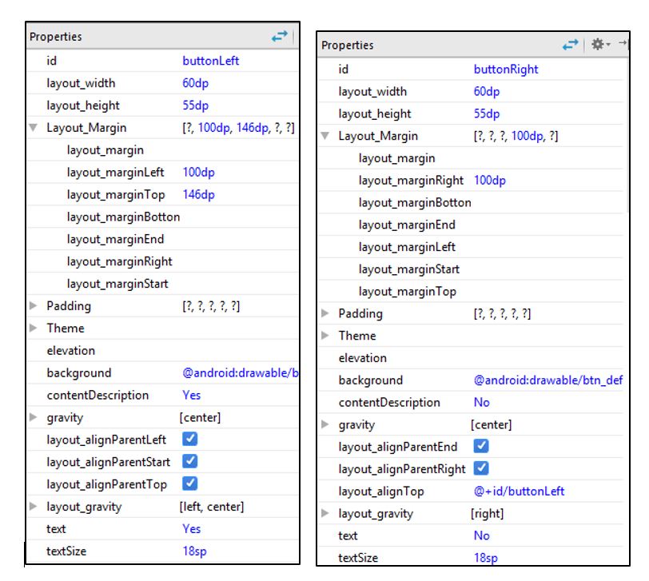

# Activity: UI Element Sizing

### Background

This module demonstrates the importance of sizing of UI elements.

A working version of this app is available at: https://github.com/milk-modules/Apps/tree/master/accessible/DemoApp03


### Prerequisite

1. Android Studio is installed on the development workstation
2. A working Android emulator is available for testing

### Approaches

There two approaches that you can take to perform this activity:

1. End-to-End development of the app by following all the below steps
2. Using a pre-created version of this project and only resizing of the UI elements:
   1. Download the code for DemoApp03 from: <https://github.com/milk-modules/Apps/tree/master/non-accessible>
   2. Perform ONLY step #3

### Steps

1. *Project Creation* - Follow the screens below to create a new project





2. *User Interface Construction (working in activity_main.xml)*

   Update the following properties of the existing Relative Layout:

   - layout_width="match_parent"
   - layout_height="match_parent"

     Within the existing Relative Layout add:

   1. **Switch**

      Update the following properties:

      - text="AlternateRendering"
      - layout_width="match_parent"
      - layout_height="wrap_content"
      - id="@+id/switchAccessibility"
      - focusable="false"

   2. **RelativeLayout**

      Update the following properties:

      - layout_width="match_parent"

      - layout_height="wrap_content"

      - id="@+id/layoutContents"

      - layout_weight="100"

      - Within this Relative Layout add the following controls:

        1. **Button**

           Update the following properties:

           - android:text="Yes"
           - android:layout_width="50dp"
           - android:layout_height="35dp"
           - android:layout_alignParentTop="true"
           - android:layout_alignParentLeft="true"
           - android:layout_alignParentStart="true"
           - android:layout_marginTop="146dp"
           - android:id="@+id/buttonLeft"
           - android:background="@android:drawable/btn_default"
           - android:gravity="center"
           - android:layout_gravity="left|center"
           - android:layout_marginLeft="130dp" 

        2. **TextView**

           Update the following properties:

           - android:text="Is this the greatest app of all time?"
           - android:layout_width="match_parent"
           - android:layout_height="wrap_content"
           - android:id="@+id/textView"
           - android:textAppearance="@android:style/TextAppearance.DeviceDefault.Medium"
           - android:layout_above="@+id/buttonRight"
           - android:layout_marginBottom="36dp"
           - android:textStyle="normal|bold"
           - android:textAlignment="center"
           - android:layout_alignParentLeft="false"
           - android:layout_alignParentStart="false"
           - android:layout_alignParentRight="false"
           - android:layout_alignParentEnd="false"
           - android:gravity="center_horizontal""

        3. **Button**

           Update the following properties:

           - android:text="No"
           - android:layout_width="45dp"
           - android:layout_height="35dp"
           - android:id="@+id/buttonRight"
           - android:layout_gravity="right"
           - android:background="@android:drawable/btn_default"
           - android:gravity="center"
           - android:layout_alignTop="@+id/buttonLeft"
           - android:layout_alignParentRight="true"
           - android:layout_alignParentEnd="true"
           - android:layout_marginRight="130dp"

   3. **RelativeLayout**

      Update the following properties:

      - layout_width="match_parent"
      - layout_height="wrap_content"
      - layout_weight="1"
      - Within this Relative Layout add the following controls:

        1. **TextView**

           Update the following properties:

           - layout_width="match_parent"
           - layout_height="wrap_content"
           - id="@+id/textViewStatus"
           - layout_alignParentTop="true"
           - layout_alignParentLeft="true"
           - layout_alignParentStart="true"
           - textAlignment="center"
           - textStyle="normal|bold"
           - layout_alignParentRight="true"
           - layout_alignParentEnd="true"
           - text="Status:"
           - gravity="bottom"


   Following is the hierarchical layout of the controls on the screen:

   


   Following is the rendering of controls on the screen:

   


3. *Resize & Respace Buttons*

   The recommend size for touch targets should be at least 48 x 48 dp. There should also be a spacing of 8dp or more between the targets.

   Select the Button with id “*buttonLeft*”. Update the following properties:
   - layout_width = 60dp
   - layout_height = 55dp
   - layout_marginLeft = 100dp
   - textSize = 18sp

   Select the Button with id “*buttonRight*”. Update the following properties:
   - layout_width = 60dp
   - layout_height = 55dp
   - layout_marginLeft = 100dp
   - textSize = 18sp



4. *Code - Replace the code in MainActivity.java with the following:*

   ```java
   package edu.rit.se.milk.demoapp03;

   import android.graphics.Color;
   import android.support.v7.app.AppCompatActivity;
   import android.os.Bundle;
   import android.support.v7.widget.ButtonBarLayout;
   import android.view.Gravity;
   import android.view.View;
   import android.view.ViewGroup;
   import android.widget.Button;
   import android.widget.CompoundButton;
   import android.widget.LinearLayout;
   import android.widget.RelativeLayout;
   import android.widget.Switch;
   import android.widget.TextView;
   import android.widget.RelativeLayout.LayoutParams;

   import java.util.Random;
   import java.util.Timer;
   import java.util.TimerTask;

   import static android.R.attr.button;

   public class MainActivity extends AppCompatActivity {

       Button buttonLeft, buttonRight;
       TextView textStatus;
       Switch switchRendering;

       RelativeLayout layoutCover;

       Timer buttonMoveTimer;

       @Override
       protected void onCreate(Bundle savedInstanceState) {
           super.onCreate(savedInstanceState);
           setContentView(R.layout.activity_main);

           buttonLeft = (Button) findViewById(R.id.buttonLeft);
           buttonRight = (Button) findViewById(R.id.buttonRight);
           textStatus = (TextView) findViewById(R.id.textViewStatus);
           switchRendering = (Switch) findViewById(R.id.switchAccessibility);
           layoutCover = (RelativeLayout) findViewById(R.id.layoutContents);

           setupEventHandlers();
       }

       private void setupEventHandlers() {
           buttonLeft.setOnClickListener(
                   new View.OnClickListener() {
                       @Override
                       public void onClick(View v) {
                           textStatus.setText("Button Tapped: \"Yes\"");
                       }
                   }
           );

           buttonRight.setOnClickListener(
                   new View.OnClickListener() {
                       @Override
                       public void onClick(View v) {
                           textStatus.setText("Button Tapped: \"No\"");
                       }
                   }
           );

           switchRendering.setOnCheckedChangeListener(new CompoundButton.OnCheckedChangeListener() {
               @Override
               public void onCheckedChanged(CompoundButton buttonView, boolean isChecked) {
                   if (isChecked) {
                       // reset();
                       buttonMoveTimer = new Timer();
                       buttonMoveTimer.schedule(new TimerTask() {
                           @Override
                           public void run() {
                               runOnUiThread(new Runnable() {
                                   @Override
                                   public void run() {
                                       moveButton();
                                   }
                               });
                           }
                       }, 0, 50);
                   } else {
                       reset();
                       buttonMoveTimer.cancel();
                   }
               }
           });
       }

       private void reset() {
           setContentView(R.layout.activity_main);

           buttonLeft = (Button) findViewById(R.id.buttonLeft);
           buttonRight = (Button) findViewById(R.id.buttonRight);
           textStatus = (TextView) findViewById(R.id.textViewStatus);
           switchRendering = (Switch) findViewById(R.id.switchAccessibility);
           layoutCover = (RelativeLayout) findViewById(R.id.layoutContents);

           setupEventHandlers();
       }

       private void moveButton() {
           Random rand = new Random();
           int leftX = rand.nextInt(1) + 1;
           int rightX = rand.nextInt(2) + 1;
           int rightY = rand.nextInt(3) + 1;
           int leftY = rand.nextInt(4) + 1;

           int directionX = rand.nextInt(2) + 1;
           int directionY = rand.nextInt(2) + 1;

           if (directionX == 1) {
               buttonLeft.setX(buttonLeft.getX() + leftX);
               buttonLeft.setY(buttonLeft.getY() + leftY);

               buttonRight.setX(buttonRight.getX() - rightX);
               buttonRight.setY(buttonRight.getY() - rightY);
           } else {
               buttonLeft.setX(buttonLeft.getX() - leftX);
               buttonLeft.setY(buttonLeft.getY() - leftY);

               buttonRight.setX(buttonRight.getX() + rightX);
               buttonRight.setY(buttonRight.getY() + rightY);
           }


       }
   }
   ```

   ​

### Explanation

The above code achieves the following:

1. A timer to move the buttons
2. Handles the onCheckedChange event of the Switch control to:
   1. Move the buttons when the switch is checked(i.e. set to “On”)
   2. Reset the layout of the buttons when unchecked(i.e. set to “Off”)
