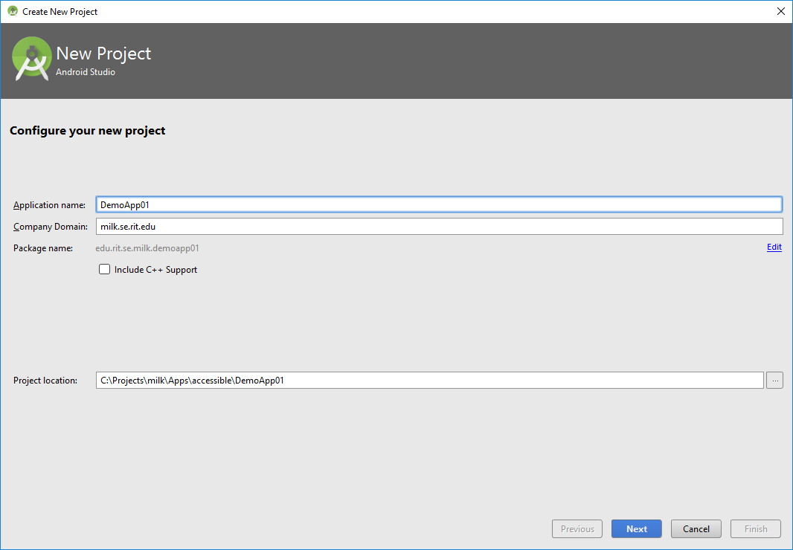
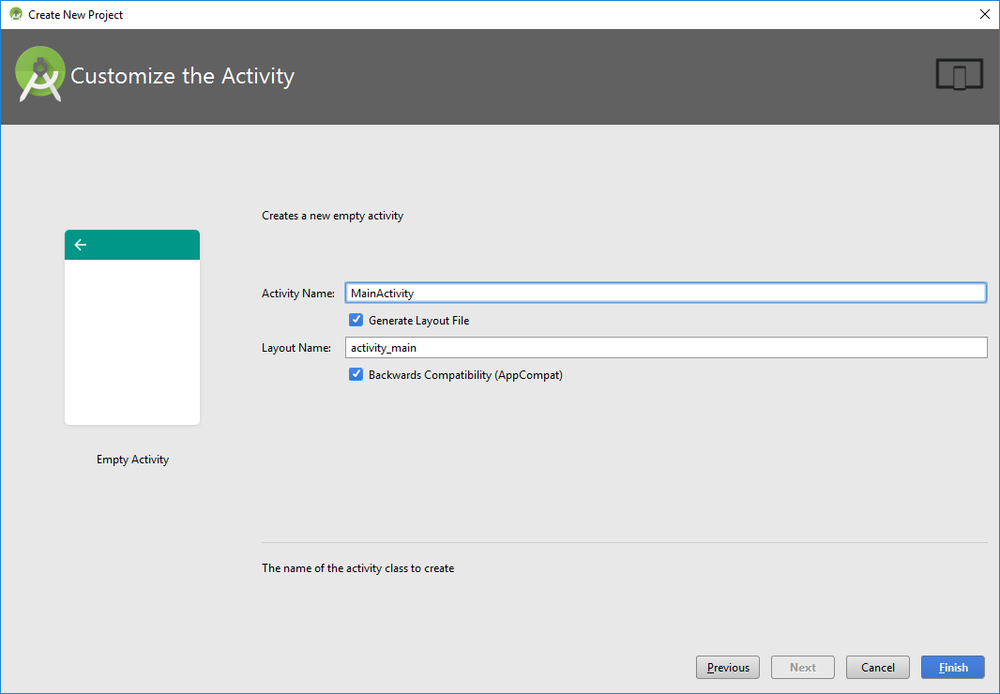
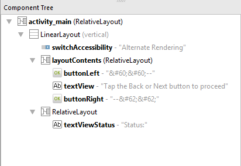
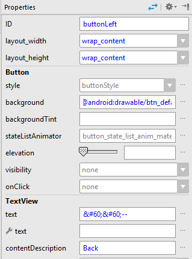

# Activity: Speech-based accessibility (Simple)

### Background

This module demonstrates the use of a UI element’s contentDescription attribute to provide speech-based accessibility.

A working version of this app is available at: https://github.com/milk-modules/Apps/tree/master/accessible/DemoApp01


### Prerequisite

1. Android Studio is installed on the development workstation
2. A working Android emulator is available for testing
3. TalkBack is enabled on the emulator (instructions: https://milk-modules.github.io/activities/general/Android_TalkBack_Install.pdf)

### Steps
There two approaches that you can take to perform this activity:

1. End-to-End development of the app by following all the below steps
2. Using a pre-created version of this project and only resizing of the UI elements:
   1. Download the code for DemoApp03 from: <https://github.com/milk-modules/Apps/tree/master/non-accessible>
   2. Perform ONLY step #3


1. *Project Creation* - Follow the screens below to create a new project







2. *User Interface Construction*

Update the following properties of the existing Relative Layout:

- layout_width="match_parent"
- layout_height="match_parent"

  Within the existing Relative Layout add:

1. **Switch**

   Update the following properties:

   - text="AlternateRendering"
   - layout_width="match_parent"
   - layout_height="wrap_content"
   - id="@+id/switchAccessibility"
   - focusable="false"

2. **RelativeLayout**

   Update the following properties:

   - layout_width="match_parent"

   - layout_height="wrap_content"

   - id="@+id/layoutContents"

   - layout_weight="100"

   - Within this Relative Layout add the following controls:

     1. **Button**

        Update the following properties:

        - android:text="&#60;&#60;--"
        - layout_width="wrap_content"
        - layout_height="wrap_content"
        - layout_alignParentTop="true"
        - layout_alignParentLeft="true"
        - layout_alignParentStart="true"
        - layout_marginTop="146dp"
        - id="@+id/buttonLeft"
        - background="@android:drawable/btn_default"
        - gravity="center"
        - layout_gravity="left|center"
        - layout_marginLeft="50dp"

     2. **TextView**

        Update the following properties:

        - text="Tap the Back or Next button to proceed"
        - layout_width="match_parent"
        - layout_height="wrap_content"
        - id="@+id/textView"
        - textAppearance="@android:style/TextAppearance.DeviceDefault.Medium"
        - layout_above="@+id/buttonRight"
        - layout_marginBottom="36dp"
        - textStyle="normal|bold"
        - textAlignment="center"
        - layout_alignParentLeft="false"
        - layout_alignParentStart="false"
        - layout_alignParentRight="false"
        - layout_alignParentEnd="false"

     3. **Button**

        Update the following properties:

        - android:text="&#62;&#62;--"
        - layout_width="wrap_content"
        - layout_height="wrap_content"
        - id="@+id/buttonRight"
        - layout_gravity="right"
        - background="@android:drawable/btn_default"
        - gravity="center"
        - layout_alignTop="@+id/buttonLeft"
        - layout_alignParentRight="true"
        - layout_alignParentEnd="true"
        - layout_marginRight="50dp"

3. **RelativeLayout**

   Update the following properties:

   - layout_width="match_parent"
   - layout_height="wrap_content"
   - layout_weight="1"
   - Within this Relative Layout add the following controls:

     1. **TextView**

        Update the following properties:

        - layout_width="match_parent"
        - layout_height="wrap_content"
        - id="@+id/textViewStatus"
        - layout_alignParentTop="true"
        - layout_alignParentLeft="true"
        - layout_alignParentStart="true"
        - textAlignment="center"
        - textStyle="normal|bold"
        - layout_alignParentRight="true"
        - layout_alignParentEnd="true"
        - text="Status:"
        - gravity="bottom"


Following is the hierarchical layout of the controls on the screen:




Following is the rendering of controls on the screen:


3. *Set Content Description*

   The “contentDescription” property of a control is utilized for accessibility purposes. The text associated with this property defines the content of this control and is used by Android’sTalkBack feature.

   Select the Button with id “buttonLeft”. Set contentDescription to “Back”
   


   Select the Button with id “buttonRight”. Set contentDescription to “Next”
   

   4. *Code -  Open MainActivity.java and add the following code:*

         1. Declare the following variables:

            ```java
            public class MainActivity extends AppCompatActivity {

                Button buttonLeft, buttonRight;
                TextView textStatus;
                Switch switchRendering;
                RelativeLayout layoutCover;
            ```

         2. Replace code inside the **onCreate** method with:

            ```java
                @Override
                protected void onCreate(Bundle savedInstanceState) {
                    super.onCreate(savedInstanceState);
                    setContentView(R.layout.activity_main);

                    buttonLeft = (Button)findViewById(R.id.buttonLeft);
                    buttonRight = (Button)findViewById(R.id.buttonRight);
                    textStatus = (TextView)findViewById(R.id.textViewStatus);
                    switchRendering = (Switch)findViewById(R.id.switchAccessibility);

                    layoutCover = (RelativeLayout)findViewById(R.id.layoutContents);

                    switchRendering.setOnCheckedChangeListener(new CompoundButton.OnCheckedChangeListener() {
                        @Override
                        public void onCheckedChanged(CompoundButton buttonView, boolean isChecked){
                            if (isChecked) {
                                layoutCover.setBackgroundColor(Color.BLACK);
                                buttonLeft.setBackgroundColor(Color.BLACK);
                                buttonRight.setBackgroundColor(Color.BLACK);
                            }
                            else
                            {
                                layoutCover.setBackgroundColor(Color.TRANSPARENT);
                                buttonLeft.setBackgroundResource(android.R.drawable.btn_default);
                                buttonRight.setBackgroundResource(android.R.drawable.btn_default);
                            }
                        }
                    });


                    buttonLeft.setOnClickListener(
                            new View.OnClickListener() {
                                @Override
                                public void onClick(View v) {
                                    textStatus.setText("Button Tapped: Back (Left)");
                                }
                            }
                    );

                    buttonRight.setOnClickListener(
                            new View.OnClickListener() {
                                @Override
                                public void onClick(View v) {
                                    textStatus.setText("Button Tapped: Next (Right)");
                                }
                            }
                    );
                }
            ```


### Explanation

The above code achieves the following:

1. Handles the onCheckedChange event of the Switch control to:
   1. Set the color of all the controls to Black so that none of the controls are visible when the switch is checked (i.e. set to“On”)
   2. Sets the colors of all the controls to their original colors when the switch is unchecked (i.e. set to “Off”)